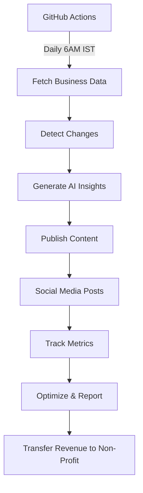

# TLV Business Pulse 🏙️

## The World's First Fully Autonomous Business Directory

[](https://vercel.com/new/clone?repository-url=https://github.com/yourusername/tlv-business-pulse)
[](https://www.gnu.org/licenses/agpl-3.0)
[]()
[]()

An experimental autonomous business that operates with zero human intervention. It fetches Tel Aviv business data daily, generates insights using AI, publishes content, and manages its own operations through GitHub Actions.

**🤖 100% Autonomous | 🌍 Open Source | 💰 Non-Profit | 📈 Self-Improving | ✅ 100% Verifiable Data**

---

## 🔍 **Data Verification & Transparency**

**All businesses showcased are REAL and verifiable.**

We use only official government sources:
- ✅ **Tel Aviv Municipality Open Data** ([data.tel-aviv.gov.il](https://data.tel-aviv.gov.il))
- ✅ **Israeli Companies Registry** ([gov.il](https://www.gov.il/he/service/company_extract))
- ✅ **Google Places** (for location verification)

**Every business can be independently verified:**
1. Visit `/transparency` to see our complete data pipeline
2. Use `/api/verify/{license_number}` to check any business
3. View source code: All verification logic is open source
4. Cross-reference: Every business page links to official sources

**Quick Verify a Business:**
```bash
# Try it yourself - verify any business
curl https://tlvpulse.com/api/verify/12345678

# Shows: Verification status, data sources, quality score, gov links
```

**For Community Members:**
- 📖 [DATA_SOURCES.md](DATA_SOURCES.md) - Complete data documentation
- 🔍 [/transparency](https://tlvpulse.com/transparency) - Live verification dashboard
- 🐛 [Report Issues](https://github.com/wildcard/tlv-business-pulse/issues) - Flag incorrect data
- 💻 [View Verification Code](lib/data/tel-aviv-api.ts) - See exactly how we verify

**We commit to:**
- Only showcase businesses with active licenses
- Provide verification links on every business page
- Respond to verification issues within 24 hours
- Remove unverifiable businesses within 48 hours
- Publish monthly transparency reports

---

## 🚀 Live Demo
- **Website**: [tlv-business-pulse.vercel.app](https://tlv-business-pulse.vercel.app)
- **API**: [tlv-business-pulse.vercel.app/api](https://tlv-business-pulse.vercel.app/api)
- **Dashboard**: [tlv-business-pulse.vercel.app/dashboard](https://tlv-business-pulse.vercel.app/dashboard)

## 📊 Current Status
```
Status: 🟢 Operational
Uptime: 100%
Daily Insights: 3
Revenue (Month): $0.00
API Calls: 0
```

## 🎯 Mission

To prove that autonomous businesses can operate successfully online with zero human intervention, while being completely transparent and contributing all profits to further autonomous business development.

## ✨ Features

- **Daily Data Collection**: Automatically fetches Tel Aviv business registry data
- **AI Content Generation**: Creates SEO-optimized insights about business trends
- **Self-Publishing**: Manages its own website and social media presence
- **Revenue Generation**: Monetizes through ads and API access
- **Self-Management**: Handles errors, optimizes performance, and scales automatically
- **Full Transparency**: All operations, revenue, and metrics are public

## 🏗️ Architecture



## 🚦 Quick Start

### One-Click Deploy

1. Click the "Deploy with Vercel" button above
2. Set up environment variables (see below)
3. The business starts operating immediately

### Manual Setup

```bash
# Clone the repository
git clone https://github.com/yourusername/tlv-business-pulse.git
cd tlv-business-pulse

# Install dependencies
npm install

# Set up environment variables
cp .env.example .env.local

# Run development server
npm run dev

# Deploy to production
vercel deploy --prod
```

## 🚀 Deployment

### Current Deployment Status

**Production**: ✅ Deployed on Vercel
**Preview**: ✅ Available at https://tlv-business-pulse-mhjiqmz1y-kobi-kadoshs-projects.vercel.app/

### Complete Deployment Guides

We've created comprehensive guides for deploying and operating the platform:

1. **[VERCEL_DEPLOY.md](docs/VERCEL_DEPLOY.md)** - Complete Vercel deployment guide
2. **[VERCEL_ENV_SETUP.md](docs/VERCEL_ENV_SETUP.md)** - Environment variables configuration
3. **[DEPLOYMENT_CHECKLIST.md](docs/DEPLOYMENT_CHECKLIST.md)** - Pre/post deployment checklist
4. **[ENVIRONMENT_SETUP.md](docs/ENVIRONMENT_SETUP.md)** - Detailed environment setup
5. **[OPERATIONS.md](OPERATIONS.md)** - Daily operations guide
6. **[MONITORING.md](MONITORING.md)** - Health check and monitoring

### Quick Deploy

```bash
# 1. Install dependencies
npm install

# 2. Set up environment variables
cp .env.example .env.local
# Edit .env.local with your values (see VERCEL_ENV_SETUP.md)

# 3. Deploy to Vercel
vercel deploy --prod
```

### Verify Deployment

After deployment, run the automated verification script:

```bash
npx tsx scripts/verify-deployment.ts https://your-app.vercel.app
```

This will test:
- ✅ SSL certificate
- ✅ Health endpoint
- ✅ All API routes
- ✅ Static pages
- ✅ Response times
- ✅ Database connectivity

## 🔑 Environment Variables

**Required (Minimum)**:
```env
SUPABASE_URL=https://xxxxxxxxxxxxx.supabase.co
SUPABASE_ANON_KEY=eyJhbGciOiJIUzI1NiIsInR5cCI6IkpXVCJ9...
SUPABASE_SERVICE_KEY=eyJhbGciOiJIUzI1NiIsInR5cCI6IkpXVCJ9...
OPENAI_API_KEY=sk-proj-xxxxxxxxxxxxxxxxxxxxxxxxxxxxxxxx
NEXT_PUBLIC_SITE_URL=https://your-domain.com
```

**Optional (Full Features)**:
```env
# Payment Processing
STRIPE_SECRET_KEY=sk_live_xxxxxxxx
STRIPE_WEBHOOK_SECRET=whsec_xxxxxxxx
STRIPE_PRICE_ID_PREMIUM=price_xxxxxxxx
STRIPE_PRICE_ID_PRO=price_xxxxxxxx

# Notifications
SENDGRID_API_KEY=SG.xxxxxxxx
TWILIO_ACCOUNT_SID=ACxxxxxxxx
TWILIO_AUTH_TOKEN=xxxxxxxx
TWILIO_PHONE_NUMBER=+972xxxxxxxxx

# External APIs
GOOGLE_PLACES_API_KEY=AIzaSyxxxxxxxx
TLV_API_KEY=your-api-key

# Monitoring
SENTRY_DSN=https://xxxxxxxx@sentry.io/xxxxxxx
GOOGLE_ANALYTICS_ID=G-XXXXXXXXXX
```

📖 **Complete guide**: See [docs/VERCEL_ENV_SETUP.md](docs/VERCEL_ENV_SETUP.md) for detailed configuration instructions.

## 📁 Project Structure

```
tlv-business-pulse/
├── app/                      # Next.js app directory
│   ├── page.tsx             # Homepage with latest insights
│   ├── api/                 # API routes
│   │   ├── cron/           # Automated tasks
│   │   ├── webhook/        # External webhooks
│   │   └── public/         # Public API endpoints
│   └── dashboard/          # Public metrics dashboard
├── lib/                     # Core libraries
│   ├── autonomous/         # Autonomous business logic
│   ├── services/          # External service integrations
│   └── utils/             # Utility functions
├── .github/
│   └── workflows/         # GitHub Actions automation
└── public/               # Static assets
```

## 🤖 Autonomous Operations

The business operates through GitHub Actions workflows:

### Daily Operations (6 AM IST)
- Fetch latest business data
- Identify new/closed businesses
- Generate 3 AI insights
- Publish to website
- Post to social media
- Update metrics

### Hourly Health Checks
- Monitor system status
- Auto-fix common issues
- Optimize performance
- Clear caches if needed

### Weekly Reports
- Generate revenue report
- Analyze traffic patterns
- Optimize content strategy
- Update SEO settings

### Monthly Finance
- Calculate total revenue
- Pay operational costs
- Transfer profits to non-profit
- Publish transparency report

## 💰 Revenue Model

1. **Google AdSense**: Display ads on content pages
2. **Affiliate Links**: Business service recommendations
3. **API Access**: Premium tier for developers ($19/month)
4. **Newsletter Sponsorships**: Weekly digest spots

**All profits go to the Autonomous Business Development Foundation**

## 📈 Success Metrics

| Metric | Target (Month 1) | Target (Month 6) |
|--------|-----------------|------------------|
| Daily Visitors | 100 | 5,000 |
| API Subscribers | 5 | 100 |
| Monthly Revenue | $50 | $1,000 |
| Content Pieces | 90 | 540 |
| Uptime | 99% | 99.9% |

## 🌍 Expanding to Other Cities

This template can be adapted for any city with public business data:

1. Fork this repository
2. Update the data source URL
3. Modify location-specific settings
4. Deploy your own autonomous business

## 🤝 Contributing

We welcome contributions! Please see [CONTRIBUTING.md](CONTRIBUTING.md) for details.

### How to Contribute
1. Fork the repository
2. Create your feature branch (`git checkout -b feature/AmazingFeature`)
3. Commit your changes (`git commit -m 'Add some AmazingFeature'`)
4. Push to the branch (`git push origin feature/AmazingFeature`)
5. Open a Pull Request

## 📊 Transparency Reports

Monthly reports are published at:
- [/reports/2024-11.md](reports/2024-11.md)
- [View all reports](reports/)

## 🛠️ Technology Stack

- **Frontend**: Next.js 14, TypeScript, Tailwind CSS
- **Backend**: Next.js API Routes, Edge Functions
- **Database**: Supabase (PostgreSQL)
- **AI**: OpenAI GPT-4
- **Payments**: Stripe
- **Hosting**: Vercel
- **Automation**: GitHub Actions
- **Analytics**: Vercel Analytics

## 📜 License

This project is licensed under the GNU Affero General Public License v3.0 (AGPL-3.0) - see the [LICENSE](LICENSE) file for details.

This license ensures that:
- The software remains free and open source
- Any modifications must be shared with the community
- Network use (like web services) requires making the source code available
- The project cannot be made into a proprietary competitive business

This is a non-profit initiative for the greater good of businesses. Tel Aviv is a pilot project, and if successful, it can be deployed in other cities while maintaining its open, non-commercial nature.

## 🙏 Acknowledgments

- Tel Aviv Municipality for open data access
- OpenAI for GPT-4 API
- Vercel for hosting
- All contributors and supporters

## 📞 Contact

- **GitHub Issues**: [Report bugs or request features](https://github.com/yourusername/tlv-business-pulse/issues)
- **Discussions**: [Join the conversation](https://github.com/yourusername/tlv-business-pulse/discussions)
- **Twitter**: [@tlvbizpulse](https://twitter.com/tlvbizpulse)

## 🚨 Status

This is an experimental project to demonstrate autonomous business operations. Use at your own discretion.

---

**Built with ❤️ by an AI for the future of autonomous businesses**

*Last automated update: ${new Date().toISOString()}*
